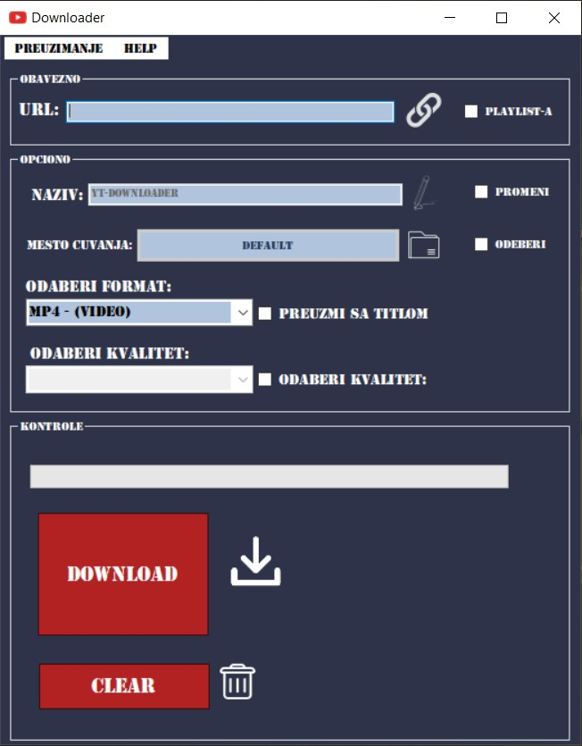

# YT-Downloader

## Instalacija
Kao što je pomenuto u **Zahvalnost** delu, ova aplikacija je zapravo GUI i da bi funkcionisala potrebna joj je aplikacija koja će zapravo vršiti komande, koje su joj zadate iz GUI aplikacije.
Dakle, yt-dlp.exe aplikacije se nalzi u istom SFX direktorijumu kao i YT-Downloadet. 
Pokretanjem tog direktorijuma, instaliraju se ove dve aplikacije, u istom direktoijum u C: particiji, u Program Files.
Prilikom pokretanja, postoji mogućnost da vas iznenadi upozorenje o potencijalnom virusu, ali to možete zanemariti, jer je ova aplikacije 100% čista (to kažu svi virusi LOL).

## Pregled Aplikacije

Prilikom uspešnog pokretanja, aplikacija će se otvoriti u prozoru koji izgleda ovako:

Aplikacija se sastoji od četiri glavna dela:
1. **Meni Deo**
  
2. **Obavezni Deo**
   
3. **Opcioni (Izborni) Deo**

4. **Kontrolni (Komandni) Deo**

### 1. Meni deo 
 

U ovom delu se nalaze dve opcije:

   a) **Preuzimanje**
   
Opcija  služi da vrati korisnika na glavni prozor.

   b) **Help**
   
Opcija služi da preusmeri korisnika na README, ukoliko ima nekih nedvoumica.

### 2. Obavezni Deo

Ovde se nalazi polje u koje se unosi link. Kako je cela poenta ove aplikacije, da se u nju unese link, na osnovu koga se skida sadržaj sa interneta, ne bi imalo smisla da se link ne unese i zbog toga je ovo obavezno polje.

### 3. Opcioni (Izborni) Deo

U ovom delu se nalaze 4 kontrole, koje korisnik može da menja nezavisno jednu od druge, ili da ih ostavi neizmenjene:

1. **Naziv**
   - Defaultna vrednost za naziv fajla koji se skida je: YT-Downloader
   - Ukoliko korisnik želi da promeni naziv fajla koji se skida, mora čekirati (označiti) opciju **Promeni**, koja se nalazi sa desne strane polja za unos.

2. **Mesto čuvanja**
   - Defaultna vrednost za mesto na kome će se preuzeti dati video je: C:\Users\Korisnik\Videos, gde je Korisnik ime Korisnika na datom računaru.
   - Ukoliko korisnik želi da promeni mesto na kome će fajl koji se skida biti sačuvan, mora čekirati (označiti) opciju **Odaberi**, koja se nalazi sa desne strane dugmeta. Nakon čekiranja, klikom na dugme se bira mesto na kome će fajl biti sačuvan.

3. **Format**
   - Defaultna vrednost za format je: .mp4, što je video + zvuk.
   - Osim .mp4, korisnik može izabrati i samo audio fajl .m4a. Ova opcija je pogodna za skidanje pesama, knjiga ili podkastova.
   - M4A ima visokokvalitetan zvuk, dok MP3 ima zvuk nižeg kvaliteta. Veličina MP3 fajla je veća, dok M4A komprimuje fajlove u manju veličinu. M4A, koristeći napredno kodiranje zvuka, mora da se pridržava određenih ograničenja, dok je MP3 veći fajl bez ograničenja.
   - Ukoliko niste zadovoljni .m4a formatom, ovde je link za moju drugu aplikaciju koja prevodi m4a u mp3 -> [WORK IN PROGRESS]

4. **Titl**
   - Defaultna vrednost za titl je: preuzimaj titl sa fajlom.
   - Korisnik može izabrati da skida titl i sa audio i sa video fajlovima, čekiranjem opcije **Preuzmi sa titlom** koja se nalazi desno od polja za odabir formata.

### 4. Kontrolni (Komandni) Deo

Kontrolni deo se takodje sastoji od 3 kontorle.

1. **Progress Bar**
   - Sa upitnom tačnošći prikazuje kako preuzimanje napreduje.

2. **Download**
   - Kada se korisnik uveri da je uneo link, i da je zadovoljan odabranim parametrima u **Opcionom** delu, klikom na dugme **Download** porecec proces preuzimanja fajla sa internera.
   - Pri završetku preuzimanja, pojaviće se poruka sa obaveštenjem. Ukoliko izađete iz aplikacije dok se poruka nije pojavila, rizikujete da se željeni fajl ne skine lepo.

3. **Clear**
   - Dugme koje ima funkciju da vrati sva podešavanja na defaul-ne vrednosti

## Pomoć

Ukoliko naiđete na bilo kakve probleme ili imate pitanja, slobodno otvorite "Issue" na ovom GitHub repozitorijumu.

## Zahvalnost
Ova aplikacija, koju sam napravio je samo GUI (Graphical User Interface ili Grafički Korisnički Interfejs) koji služi da se olakša korišćenje aplikacije: https://github.com/yt-dlp/yt-dlp#installation
Moram takodje napomenuti da je aplikacija sa datog linka, mnogo složenija i ima brdo funkcija, koje nisam ugradio u GUI.
